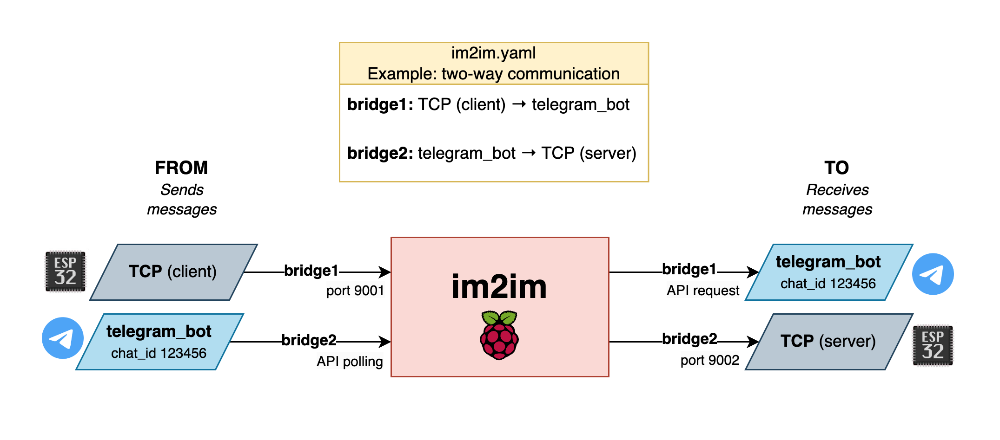

# im2im

Proof of Concept: daemon to bridge between two instant messaging protocols.

The service listens for incoming messages on a given protocol and forwards them to another protocol. It's designed to be extensible to support the addition of new protocols and configuring their usage via a configuration file (YAML).

## Overview

Example for sending and receiving messages between netcat ⇔ Telegram Bot API.



## Implementation

* Go 1.20, each bridge spawns two goroutines (sender/receiver) and uses one channel to communicate the message.

## Installation

### From source

```bash
```

### Docker

```bash
```

## Usage

### Configuration

```bash
cp im2im.yaml.example im2im.yaml
```

### im2im.yaml

```yaml
```

### Running

```bash
nc localhost 9001
```

```bash
nc -l 9002
```

## Supported protocols

* netcat (TCP socket)
* Telegram Bot (coming soon)
* ...?

## Contributing

See [CONTRIBUTING.md](CONTRIBUTING.md) for submitting pull requests.

## License

MIT License
Copyright (c) 2023 Andrei Regiani
